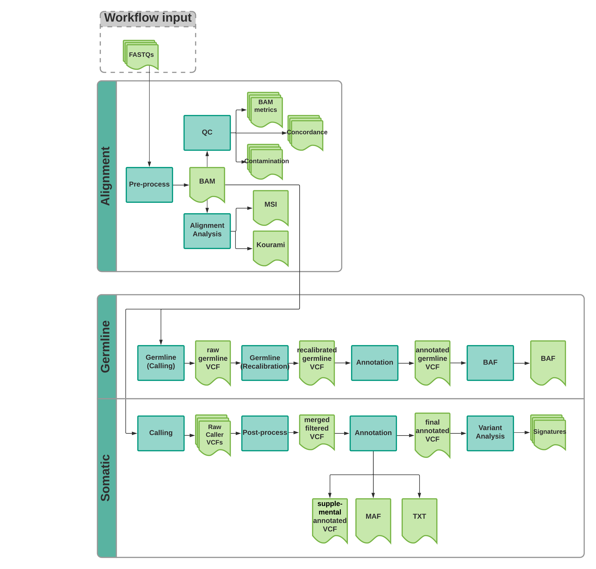

# wdl_port


## WDL docs for v6 pipeline

- [Dependencies](#dependencies)
- [On prem environment setup](#environment)
- [Write input and submit](#write_input)
- [Post run reports](#post_run)
- [Create new workflow](#create_new_workflow) 
- [Appendix](#appendix)
  - [Cram incompatible steps](#cram-incompatible)
  - [Cram compatible steps](#cram-compatible)
- [Contact us](#contact_us)



### Dependencies
<a name="dependencies"></a>

- gcloud 
- gsutil
- cromwell-tools
- jq
- womtools

Python

- pandas
- jsonschema


### On prem environment setup
<a name="environment"></a>


Set up on prem:

```
# run in this order
module load gcloud cromwell-tools jq
. /gpfs/commons/groups/nygcfaculty/kancero/envs/miniconda3/etc/profile.d/conda.sh
conda activate wdl
```

### Write input and submit
<a name="write_input"></a>


Script `wdl_port/run.sh` will first quickly validate the WDL workflow. Next it will use the WDL 
to determine which variables are required. All required variables will be defined from the 
Reference JSON in config, the pairing/sample info or the custom inputs JSON.

Any URI for a file will be validated to ensure you can read the file (unless the `--skip-validate` flag is used).

Next, the input JSON will be compared to the original WDL and the program will exit if any required variable could not be found and will need to be provided in the custom input JSON.

Then the workflow will be submitted to the cromwell server.

In addition to submitting the command, this will create an output file that you should save. It contains information about the project, pipeline version, cromwell options, inputs. It will also contain the workflow UUID. This will be used after the run to agregate information about the run.
```
wdl_port/run.sh -h
USAGE: run.sh [-h] --options OPTIONS --wdl-file WDL_FILE
               --url URL --log-dir LOG_DIR
               --project PROJECT 
               [--library {WGS,Exome}]
               [--genome {Human_GRCh38_full_analysis_set_plus_decoy_hla}]
               [--pairs-file PAIRS_FILE]
               [--samples-file SAMPLES_FILE]
               [--interval-list {SureSelect_V6plusCOSMIC.target.GRCh38_full_analysis_set_plus_decoy_hla}]
               [--custom-inputs [CUSTOM_INPUTS [CUSTOM_INPUTS ...]]]
               [--skip-validate]
DESCRIPTION: validate workflow, create input json and submit workflow to cromwell.
Script requires jq, cromwell-tools, gcloud to be in the path.
Script shows submission command and command to check status
in the STDERR stream.

-h, --help            show this help message and exit
  --url URL             Cromwell server URL (required)
  --log-dir LOG_DIR     Output directory for all logs and reports
                        related to this workflow UUID (required)
  --options OPTIONS     Options json file (required)
  --wdl-file WDL_FILE   WDL workflow. An input JSON that matches this
                        WDL workflow will be created (required)
  --library {WGS,Exome}
                        Sequence library type.
  --genome {Human_GRCh38_full_analysis_set_plus_decoy_hla}
                        Genome key to use for pipeline.
  --project PROJECT     Project name associated with account.
  --pairs-file PAIRS_FILE
                        JSON file with items that are required to have
                        \"tumor\", \"normal\" sample_ids defined.
  --samples-file [SAMPLES_FILE]
                        Not generally required. If steps run only require
                        sample_id and do not use pairing information sample
                        info can be populated with a CSV file. The CSV file
                        requires a columns named [\"sampleId\"].
  --interval-list {SureSelect_V6plusCOSMIC.target.GRCh38_full_analysis_set_plus_decoy_hla}
                        File basename for interval list.If not supplied the
                        default (the SureSelect interval list for your genome)
                        will be used
  --custom-inputs [CUSTOM_INPUTS]
                        Optional JSON file with custom input variables. The
                        name of the variable in the input file must match the
                        name of the variable in the WDL workflow. It is not
                        required that the input specify the workflow. By
                        default the input will be added to the top-level
                        workflow.
  --skip-validate       Skip the step where input files are validated.
                        Otherwise all gs//: URIs will be checked to see that a
                        file exists. Disable with caution.Cromwell will launch
                        instances and run without checking. Test a small pairs
                        file to ensure all references exist and at least some
                        sample input files can be read by the current user.
```

Command

```
# Create input json
./wdl_port/run.sh \
--log-dir ${working-dir} \
--url ${url} \
--project ${lab_quote_number} \
--pairs-file ${tumor_normal_pairs_csv} \
--library WGS \
--genome Human_GRCh38_full_analysis_set_plus_decoy_hla \
--wdl-file wdl_port/calling_wkf.wdl \
--options options.json
```


#### Output:

  1. `calling_wkfInput.json` - inputs for cromwell
  2. `${lab_quote_number}_projectInfo.json` - contains project info like the current list of samples/pairs and the library type as well as the pipeline version (tag and commit). 
  3. `${lab_quote_number}_project.<DATE>.RunInfo.json` - contains projectInfo, workflow Input, workflow UUID.


### Post run
<a name="post_run"></a>

Use the `cromwell-tools status` command printed to the screen when you submitted the workflow. Alternately, lookup the workflow UUID in the `lab-number_project.<DATE>.RunInfo.json` and run:

```
cromwell-tools status \
--url ${url} \
--username $(gcloud secrets versions access latest --secret="cromwell_username") \
--password $(gcloud secrets versions access latest --secret="cromwell_password") \
--uuid ${uuid}
```

After workflow finishes and the status is `SUCCEEDED` run:

```
bash wdl_port/run_post.sh \
-u ${url} \
-d ${log_dir} \
-p ${project_id}
```

#### Output:
If the workflow finishes and the status is `SUCCEEDED` and you have run `run_post.sh`. It will output several log files:

`${lab_quote_number}<WORKFLOW_UUID>_outputInfo.json` :

In addition to the content of `${lab_quote_number}_project.<DATE>.RunInfo.json` the file includes:

  - `outputs`: map between workflow output object-name and object (including the file URIs)
  - `unnamed`: list of files in the output bucket that are not from this workflow
  - `pair_association` : map of pair_ids to the `outputs` map for just that pair 
  - `sample_association` : map of sample_ids to the `outputs` map for just that sample 
  - `sub_workflow_uuids`: map of sample/pair ids to the `sub_workflow_uuids` for that id

Note: Pair association only works if the pair_id is used in the filename followed by a `.` or a `_`. Sample association only works if the sample_id is used in the filename followed by a `.` or a `_`. 


`${lab_quote_number}<WORKFLOW_UUID>_outputMetrics.csv`
the file includes the following metrics calculated from the BigQuery cromwell monitor:

    'id', 'project_id', 'zone', 'instance_name', 
    'preemptible', 'workflow_name', 'workflow_id', 
    'task_call_name', 'shard', 'attempt', 
    'start_time', 'end_time', 'execution_status', 
    'cpu_count', 'mem_total_gb', 'disk_mounts', 
    'disk_total_gb', 'disk_types', 'docker_image',
    'inputs', 'run_time', 'run_time_m', 
    'cpu_time_m', 'mean_task_core_h', 'mean_task_run_time_h', 
    'sample_task_run_time_h', 'max_mem_g', 'sample_task_core_h',
    'sample_subworkflow_core_h', 'sample_subworkflow_run_time_h', 
    'subworkflow_max_mem_g', 'sample_workflow_core_h', 
    'sample_workflow_run_time_h', 'workflow_max_mem_g'
  
  

### Create new workflow
<a name="create_new_workflow"></a>

Use a [style guide](https://biowdl.github.io/styleGuidelines.html) to write you WDL files.

1. Write a new workflow (e.g. `wdl_port/new_wkf.wdl`) using structs from `wdl_structs.wdl` were needed. Use the variable from `config/fasta_references.json` and `config/interval_references.json` in your workflow (e.g. `referenceFa`)
  - keep your tasks and sub workflow in a separate WDL file in a subdirectory. That workflow should run a section of the pipeline on one sample/pair. 
  - In the main directory make a WDL that runs the sub workflow(s) for a list of `sampleInfo` or `pairInfo` objects.
  - Alternately add your subworkflow to an existing main workflow (e.g. `calling_wkf.wdl`)
2. Add any new required resource files to `config/fasta_references.json` and `config/interval_references.json`.
3. Upload any new resource files:

```
# modified or in-house files
gsutil cp \
${file} \
gs://nygc-comp-s-fd4e-resources/GRCh38_full_analysis_set_plus_decoy_hla/internal/
# external reference files
gsutil cp \
${file} \
gs://nygc-comp-s-fd4e-resources/GRCh38_full_analysis_set_plus_decoy_hla/external/
```
4. Confirm all workflows are still valid and commit changes

Also confirm that all workflows continue to be valid before commiting your changes

```
for file in */*wdl *wdl; do 
  echo $file; 
  womtool validate $file; 
done
# commit your changes and create new inputs file (with new branch and commit info)
git commit -m "feat: my new workflow"
```

5. [Run](#write_input) the new workflow as before

### Appendix
<a name="appendix"></a>

##### Cram incompatible steps
<a name="cram-incompatible"></a>

- biqsec2 norm
- svaba?
- lancet
- mantis kmer counter ?


##### Cram compatible steps
<a name="cram-compatible"></a>

- strelka2
- mutect2
- gridss
- manta
- all samtools/pysam steps
- kourami w/ custom prep


### Contact us 
<a name="contact_us"></a>

We are in the process of setting up a public issue tracker. In the mean time  please send suggestions, questions or issues to jshelton@nygenome.org
