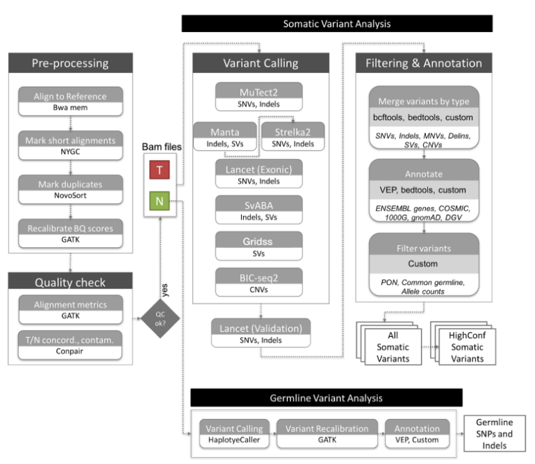
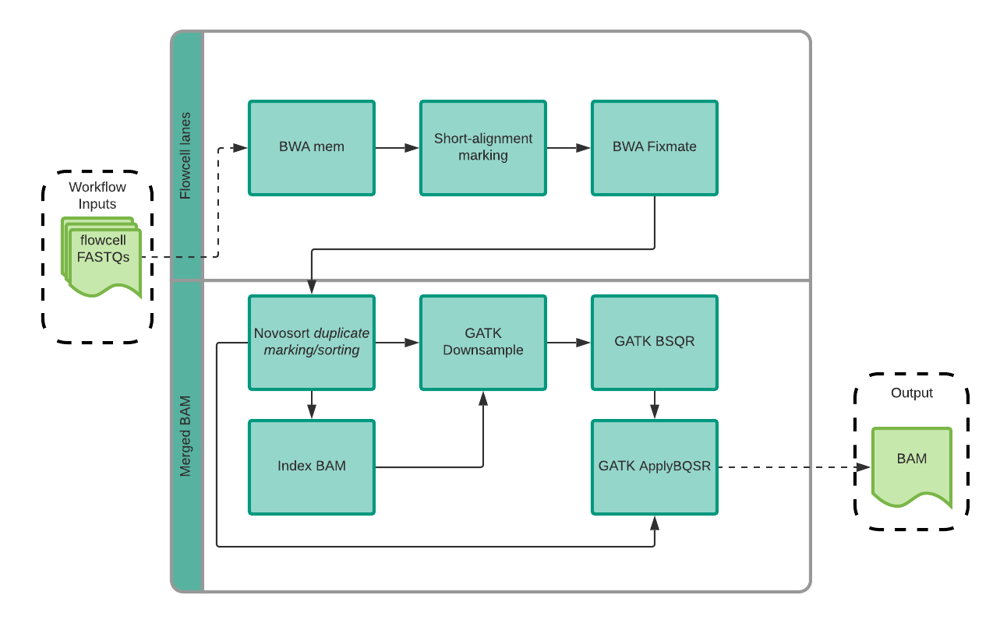
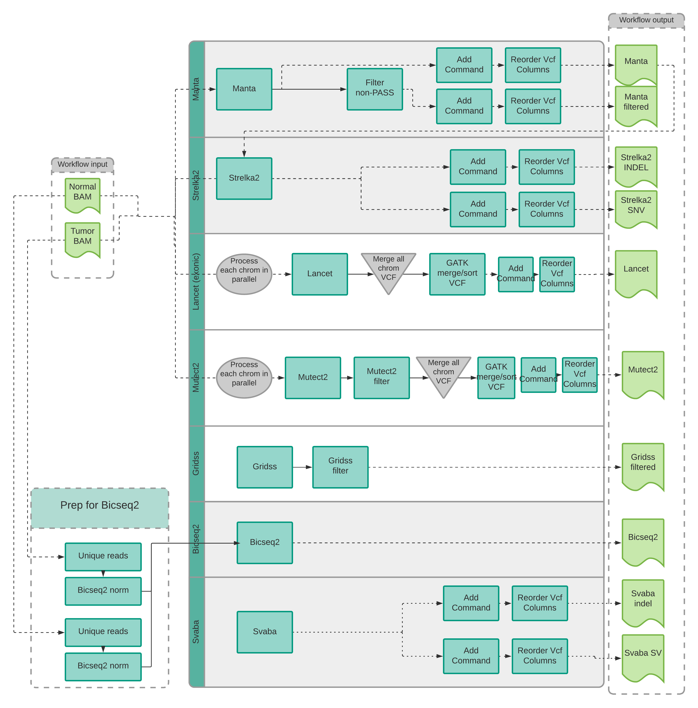
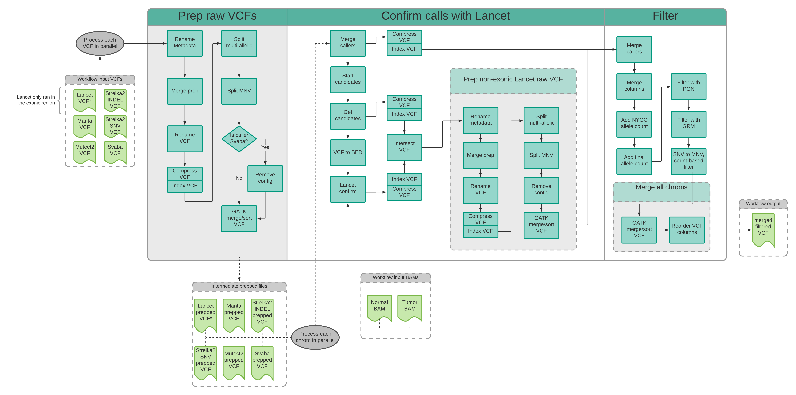

# NYGC Somatic Pipeline v7

## WGS Human Somatic Pipeline v7
- [Deliverables](#deliverables)
- [Pre-processing](#pre_processing)
- [Quality control](#qc)
- [Somatic variant calling pipeline](#variant_calling)
- [Somatic variant merging](#variant_merging)
- [Somatic variant filtering](#variant_filtering)
- [Somatic variant calling annotation](#variant_annotation)
- [Germline analysis](#germline_analysis)
- [Microsatellite Instability](#msi_detection)
- [HLA typing](#hla_typing)
- [Mutational signatures](#mutational_signature_analysis)
- [Ancestry](#ancestry)
- [References](#references)

### Deliverables

BAM alignments

- TUMOR.final.bam
- TUMOR.final.bai
- NORMAL.final.bam
- NORMAL.final.bai
 
SNV/INDEL/SV

- Raw SNV/INDEL/SV/CNV calls
  - TUMOR--NORMAL.indel.strelka2.vcf
  - TUMOR--NORMAL.snv.strelka2.vcf
  - TUMOR--NORMAL.lancet.vcf
  - TUMOR--NORMAL.manta.filtered.vcf
  - TUMOR--NORMAL.mutect2.vcf
  - TUMOR--NORMAL.sv.gridss.vcf.bgz
  - TUMOR--NORMAL.sv.gridss.vcf.bgz.tbi
  - TUMOR--NORMAL.sv.svaba.vcf
  - TUMOR--NORMAL.indel.svaba.vcf
  - TUMOR--NORMAL.bicseq2.png
  - TUMOR--NORMAL.bicseq2.txt
 
Merged SNV/INDEL

- SNV/INDEL calls annotated and filtered by PON and common germline variants
- HighConfidence calls
  - TUMOR--NORMAL.snv.indel.high_confidence.v7.annotated.vcf
- HighConfidence and AllSomatic (passing) calls
  - TUMOR--NORMAL.snv.indel.final.v7.annotated.vcf
- HighConfidence and AllSomatic (passing) calls (with all INFO fields from original callers)
  - TUMOR--NORMAL.snv.indel.supplemental.v7.annotated.vcf
- MAF formatted calls
  - TUMOR--NORMAL.snv.indel.final.v7.annotated.maf
- TABLE formatted calls
  - TUMOR--NORMAL.snv.indel.final.v7.annotated.txt

Merged SV

- SV calls annotated and filtered by PON and common germline variants
- HighConfidence calls
  - TUMOR--NORMAL.sv.annotated.v7.somatic.high_confidence.final.bedpe
- HighConfidence calls (with all INFO fields from original callers)
  - TUMOR--NORMAL.sv.annotated.v7.somatic.high_confidence.supplemental.bedpe
- HighConfidence and AllSomatic (passing) calls
  - TUMOR--NORMAL.sv.annotated.v7.somatic.final.bedpe
- HighConfidence and AllSomatic (passing) calls (with all INFO fields from original callers)
  - TUMOR--NORMAL.sv.annotated.v7.somatic.supplemental.bedpe

Final CNV

- CNV calls annotated and filtered by PON and common germline variants
  - TUMOR--NORMAL.cnv.annotated.v7.final.bed
  - TUMOR--NORMAL.cnv.annotated.v7.supplemental.bed

Germline

- All calls (including common germline variants)
  - NORMAL.haplotypecaller.gatk.annotated.unfiltered.vcf
- Rare germline variants
  - NORMAL.haplotypecaller.gatk.final.filtered.vcf.gz
  - NORMAL.haplotypecaller.gatk.final.filtered.vcf.gz.tbi
- B-allele frequency
  - TUMOR--NORMAL.haplotypecaller.gatk.baf.txt

MSI status

- Final MSI Status
  - TUMOR--NORMAL.mantis.v1.0.4.WGS-targeted.status.final.tsv
- Additional Mantis output
  - TUMOR--NORMAL.mantis.WGS-targeted.kmer_counts.txt
  - TUMOR--NORMAL.mantis.WGS-targeted.kmer_counts_filtered.txt
  - TUMOR--NORMAL.mantis.WGS-targeted.txt
 
HLA

- Kourami results
  - NORMAL.kourami.result
 
Mutational Signatures

- Raw deconstructSigs from HighConfidence variables
  - TUMOR--NORMAL.cosmic.v3.2.deconstructSigs.signatures.highconfidence.counts.txt
  - TUMOR--NORMAL.cosmic.v3.2.deconstructSigs.signatures.highconfidence.diff.txt
  - TUMOR--NORMAL.cosmic.v3.2.deconstructSigs.signatures.highconfidence.input.txt
  - TUMOR--NORMAL.cosmic.v3.2.deconstructSigs.signatures.highconfidence.reconstructed.txt
- Estimated proportion of each signature in the sample
  - TUMOR--NORMAL.cosmic.v3.2.deconstructSigs.signatures.highconfidence.txt
  
QC and Contamination

- Conpair concordance at all markers and homozygous markers
  - TUMOR--NORMAL.concordance.all.conpair-0.1.txt
  - TUMOR--NORMAL.concordance.homoz.conpair-0.1.txt
  - TUMOR--NORMAL.contamination.conpair-0.1.txt
  
- Auto-correlation
  - SAMPLE_ID.HsMetrics.perTargetCoverage.txt
  - SAMPLE_ID.HsMetrics.perTargetCoverage.txt.autocorr
  - SAMPLE_ID.HsMetrics.txt
- Final Auto-correlation metrics
  - SAMPLE_ID.autocorroutput.1.100.txt

- MultipleMetrics on final BAM
  - SAMPLE_ID.MultipleMetrics.alignment_summary_metrics
  - SAMPLE_ID.MultipleMetrics.base_distribution_by_cycle.pdf
  - SAMPLE_ID.MultipleMetrics.base_distribution_by_cycle_metrics
  - SAMPLE_ID.MultipleMetrics.insert_size_histogram.pdf
  - SAMPLE_ID.MultipleMetrics.insert_size_metrics
  - SAMPLE_ID.MultipleMetrics.quality_by_cycle.pdf
  - SAMPLE_ID.MultipleMetrics.quality_by_cycle_metrics
  - SAMPLE_ID.MultipleMetrics.quality_distribution.pdf
  - SAMPLE_ID.MultipleMetrics.quality_distribution_metrics
- MultipleMetrics on pre-BQSR BAM
  - SAMPLE_ID.MultipleMetrics.dedup.quality_by_cycle.pdf
  - SAMPLE_ID.MultipleMetrics.dedup.quality_by_cycle_metrics
  - SAMPLE_ID.MultipleMetrics.dedup.quality_distribution.pdf
  - SAMPLE_ID.MultipleMetrics.dedup.quality_distribution_metrics
  
- CollectWgsMetrics on final BAM
  - SAMPLE_ID.CollectWgsMetrics.txt
- CollectWgsMetrics on pre-BQSR BAM
  - SAMPLE_ID.CollectWgsMetrics.dedup.txt

- FlagStat
  - SAMPLE_ID.FlagStat.txt
  
- GC Bias metrics
  - SAMPLE_ID.GcBiasMetrics.gc_bias.pdf
  - SAMPLE_ID.GcBiasMetrics.gc_bias_metrics
  - SAMPLE_ID.GcBiasMetrics.gc_bias_summary
  
- OxoG artifact estimates
  - SAMPLE_ID.CollectOxoGMetrics.txt
  
- Relative coverage estimate
  - SAMPLE_ID.binest.coverage.png
  - SAMPLE_ID.binest.coverage.txt
  
- Ancestry estimation
  - SAMPLE_ID.plink.admixture.5pops.tsv
  - SAMPLE_ID.plink.admixture.pca.pdf
  - SAMPLE_ID.plink.admixture.subpops.tsv
  
- Summary report
  - TUMOR--NORMAL.v7.final.report.html

### Pre-processing

Sequencing reads for the tumor and normal samples are aligned to the reference genome using BWA-MEM (v0.7.15) ([1](#1)).
Skewer (v0.2.2) ([2](#2)) is run to trim remaining adapter contamination from reads. NYGC’s ShortAlignmentMarking (v2.1) 
is used to mark short reads as unaligned. This tool is intended to remove spurious alignments resulting from 
contamination (e.g. saliva sample bacterial content) or from too aggressive alignments of short reads the size of
BWA-MEM’s 19bp minimum seed length. These spurious alignments result in pileups in certain locations of the genome
and can lead to erroneous variant calling. 

GATK (v4.1.8.0) ([3](#3)) FixMateInformation is run to verify and fix mate-pair information, followed by Novosort 
(v1.03.01) markDuplicates to merge individual lane BAM files into a single BAM file per sample. Duplicates are 
then sorted and marked, and GATK’s base quality score recalibration (BQSR) is performed. The final result of the 
pre-processing pipeline is a coordinate sorted BAM file for each sample.

### Quality control

Once preprocessing is complete, we compute a number of alignment quality metrics such as
average coverage, percent mapped reads and percent duplicate reads using GATK (v4.1.0) and an
autocorrelation metric (adapted for WGS from ([3](#3))) to check for unevenness of coverage. We also
run Conpair ([4](#4)), a tool developed at NYGC to check the genetic concordance between the
normal and the tumor sample and to estimate any inter-individual contamination in the samples.

### Somatic variant calling pipeline

#### Variant detection
The tumor and normal bam files are processed through NYGC’s variant calling pipeline which
consists of MuTect2 (GATK v4.0.5.1) ([5](#5))), Strelka2 (v2.9.3) ([6](#6)) and Lancet (v1.0.7) ([7](#7))] for calling
Single Nucleotide Variants (SNVs) and short Insertion-or-Deletion (Indels), SvABA (v0.2.1) ([8](#8))
for calling Indels and Structural variants (SVs), Manta (v1.4.0) ([9](#9)) for
calling SVs and BIC-Seq2 (v0.2.6) ([10](#10)) for calling Copy-number variants (CNVs). Manta also
outputs a candidate set of Indels which is provided as input to Strelka2 (following the developers
recommendation, as it improves Strelka2’s sensitivity for calling indels >20nt). Due to its
computing requirements, in this pipeline Lancet is only run on the exonic part of the genome. It
is also run on the +/- 250nt regions around non-exonic variants that are called by only one of the
other callers, to add confidence to such variants. Small SVs called by Manta are also used to
add confidence to the indel calls.

#### Variant merging

Next, the calls are merged by variant type (SNVs, Multi Nucleotide Variants (MNVs), Indels and
SVs). MuTect2 and Lancet call MNVs, however Strelka2 does not, and it also does not provide
any phasing information. So to merge such variants across callers, we first split the MNVs called
by MuTect2 and Lancet to SNVs, and then merge the SNV callsets across the different callers. If 
the caller support for each SNV in a MNV is the same, we merge them back to MNVs.
Otherwise those are represented as individual SNVs in the final callset.
Lancet and MantaSV are the only tools that can call deletion-insertion (delins or COMPLEX)
events. Other tools may represent the same event as separate yet adjacent indel and/or SNV
variants. Such events are relatively less frequent, and difficult to merge. We therefore do not
merge COMPLEX calls with SNVs and Indels calls from other callers.

The SVs are converted to bedpe format, all SVs below 500bp are excluded and the rest are
merged across callers using bedtools ([11](#11)) pairtopair (slop of 300bp, same strand orientation,
and 50% reciprocal overlap).

### Somatic variant filtering

#### Panel Of Normals
The Panel Of Normals (PON) filtering removes recurrent technical artifacts from the somatic
variant callset ([5](#5)).

#### PON generation
The Panel of Normals for SNVs and indels was created with whole-genome sequencing
data from normal samples from 242 unrelated individuals. Of these, sequencing data for 148
individuals was obtained from the Illumina Polaris project which was sequenced on the HiSeqX
platform with PCR-free sample preparation. The remaining samples were sequenced by the
NYGC. Of these, 73 individuals were sequenced on HiSeqX, 11 on NovaSeq, and 10 were
sequenced on both.

We ran MuTect2 in artifact detection mode and Lumpy ([23](#23)) in single sample mode on these
samples. For SNVs and indels, we created a PON list file with sites that were seen in two or
more individuals.

For SVs, we used the 2504 unrelated resequenced 1000G individuals ([24](#24)) as the basis for the new SV PON. Each sample was sequenced in-house at the NYGC with TruSeq PCR-Free library preparation on the Illumina Novaseq-6000 to a targeted depth of of 30X (mean 34X). Samples were aligned to GRCh38 with BWA-MEM and base quality scores were recalibrated with GATK BQSR. 

Four structural variant callers were run in single sample mode with default parameters: GRIDSS 2.12.0, Manta 1.4.0, LUMPY 0.2.13, and SvABA 1.1.3. Of these four callers, GRIDSS, Manta, and Svaba are used in the v7 somatic pipeline. LUMPY was included after it was determined that it improved artifact detection sensitivity. 

#### PON filtering
For SNVs and Indels, we use the PON list to filter the somatic variants in the merged SNV and
indel files. To filter our somatic SV callset, we merge our PON list with our callset using bedtools
pairtopair (slop of 300bp, same strand orientation, and 50% reciprocal overlap), and filtered
those SVs found in two or more individuals in our PON.

####  Common germline variants
In addition to the PON filtering, we remove SNVs and Indels that have minor allele frequency
(MAF) of 1% or higher in either 1000Genomes (phase 3) or gnomAD (r2.0.2) ([25](#25)), and SVs that
overlap DGV and 1000Genomes (phase3). CNVs are annotated with DGV and 1000 Genomes
but not filtered.

### Somatic variant annotation

#### SNVs and Indels
SNVs and Indels are annotated with Ensembl Variant Effect Predictor (v97) as well as databases such as COSMIC (v92)
([12](#12)), 1000Genomes (Phase3) ([13](#13)) , ClinVar (201904) ([14](#14)), Polyphen2 (v2.2.2) ([15](#15)), SIFT (v5.2.2) ([16](#16)), FATHMM (v2.1) ([17](#17)), gnomAD (r2.0.2) ([18](#18)) and dbSNP (v150) ([19](#19)) using Variant Effect Predictor (v93.2) ([20](#20)).

#### CNVs and SVs
For CNVs, segments with log2 > 0.2 are categorized as amplifications, and segments with log2
< -0.235 are categorized as deletions (corresponding to a single copy change at 30% purity in a
diploid genome, or a 15% Variant Allele Fraction). CNVs of size less than 20Mb are denoted as
focal and the rest are considered large-scale.

We use bedtools for annotating SVs and CNVs. All predicted CNVs are annotated with
germline variants by overlapping with known variants in 1000 Genomes and Database of
Genomic Variants (DGV) ([21](#21)). Cancer-specific annotation includes overlap with genes from
Ensembl ([22](#22)) and Cancer Gene Census in COSMIC, and potential effect on gene structure (e.g.
disruptive, intronic, intergenic). If a predicted SV disrupts two genes and strand orientations are
compatible, the SV is annotated as a putative gene fusion candidate. Note that we do not check
reading frame at this point. Further annotations include sequence features within breakpoint
flanking regions, e.g. mappability, simple repeat content and segmental duplications.

#### Allele counts
Since our variant callsets are generated by merging calls across callers, and each of them
reported different allele counts, we report final chosen allele counts for SNVs and indels. For
SNVs, and for indels less than 10nt in length, these are computed as the number of unique
read-pairs supporting each allele using the pileup method, with minimum mapping quality and
base quality thresholds of 10 each.
For larger indels and complex (deletion-insertion) events, we choose the final allele counts
reported by the individual callers Strelka2, MuTect2, Lancet, in that order. For indels larger than
10nt that are only called by SvABA, we do not report final allele counts and allele frequencies
because SvABA does not report the reference allele count, making it difficult to estimate the
variant allele frequency.
We then use these final chosen allele counts and frequencies to filter the somatic callset.
Specifically, we filter any variant for which the variant allele frequency (VAF) in the tumor
sample is less than 0.0001, or if the VAF in the normal sample is greater than 0.2, or if the depth
at the position is less than 2 in either the tumor sample or the normal sample. We also filter
variants for which the VAF in normal sample is greater than the VAF in tumor sample.

#### All Somatic and High-confidence variants
Variants that pass all of the above-mentioned filters are included in our final somatic callset
(hereby referred to as AllSomatic).
For SNVs, indels and SVs, we also annotate a subset of the somatic callset as high confidence.
For SNVs and indels, high confidence calls are defined as those that are either called by two or
more variant callers, or called by one caller and also seen in the Lancet validation calls or in the
Manta SV calls.
For structural variants, high confidence calls are taken from the somatic callset if they meet the
following criteria: called by 2 or more variant callers, or called by Manta with
additional support from nearby CNV changepoint. Nearby
CNV changepoints are determined by overlapping BIC-Seq2 calls with the SV callset using
bedtools closest. An SV is considered to be supported by a CNV changepoint if the breakpoint
of the CNV is within 1000bp of an SV breakpoint.

### Germline variant analysis

We call germline SNPs and indels on the matched normal sample using GATK HaplotypeCaller
(v4.1.8.0), which generates a single-sample GVCF. We then run GATK’s GenotypeGVCF to
perform single sample genotype refinement and output a VCF, followed by variant quality score
recalibration (VQSR) for variant filtering. See the "Variant annotation" section for details.

### MSI detection

We run MANTIS (v1.0.4) ([26](#26)) for Microsatellite Instability (MSI) detection in microsatellite loci
(found using RepeatFinder, a tool included with MANTIS). A sample is considered to be
microsatellite unstable if it’s Step-Wise Difference score reported by MANTIS is greater than 0.4
(or 0.62 in absence of a matched-normal). Otherwise it is considered to be microsatellite stable
(MSS).

### HLA-typing

We run Kourami (v0.9.6) ([27](#27)) on the matched normal sample for
Human Leukocyte Antigen (HLA)-typing. Kourami prep is run with a [custom prep pipeline](https://bitbucket.nygenome.org/projects/COMPBIO/repos/hla_prep/browse).
Kourami predicts both major histocompatibility 
complex (MHC) Class I alleles (HLA-A, HLA-B, HLA-C) and
Class II alleles (HLA-DP, HLA-DQ, HLA-DR).

### Mutational signature analysis

We run deconstructSigs (v1.9.0) ([28](#28)) on the High Confidence somatic SNV callset within
autosomes to estimate contribution of known COSMIC mutational signatures (v3)
in the tumor sample.

### Ancestry

Ancestry proportion is determined by the software ADMIXTURE v1.3.0 ([29](#29)), which uses a
maximum likelihood-based method to estimate the proportion of reference population ancestries
in a sample. We genotyped the reference markers generated from 1,964 unrelated 1000
Genomes project samples directly on the RNASeq samples using GATK pileup. Individuals from
populations MXL (Mexican Ancestry from Los Angeles USA), ACB (African Caribbean in
Barbados), and ASW (African Ancestry in Southwest US) were excluded from the reference due
to being putatively admixed. The reference was further filtered by using only SNP markers with a
minimum minor allele frequency (MAF) of 0.01 overall and 0.05 in at least one 1000 genomes
superpopulation. Variants are additionally linkage disequilibrium (LD) pruned using PLINK v1.9 ([30](#30))
with a window size of 500kb, a step size of 250kb and r2 threshold of 0.2, resulting in 122377
markers remaining. The analysis results in a proportional breakdown of each sample into 5
superpopulations (AFR, AMR, EAS, EUR, SAS) and 23 subpopulations 

### References

1. Li,H. (2013) Aligning sequence reads, clone sequences and assembly contigs with BWA-MEM. arXiv [q-bio.GN].

2. Jiang,H. et al.(2014) Skewer: a fast and accurate adapter trimmer for next-generation sequencing paired-end reads. BMC Bioinformatics., 15, 182.

3. McKenna,A., Hanna,M., Banks,E., Sivachenko,A., Cibulskis,K., Kernytsky,A., Garimella,K., Altshuler,D., Gabriel,S., Daly,M., et al. (2010) The Genome Analysis Toolkit: a MapReduce framework for analyzing next-generation DNA sequencing data. Genome Res., 20, 1297–1303.

4. Bergmann,E.A., Chen,B.-J., Arora,K., Vacic,V. and Zody,M.C. (2016) Conpair: concordance
and contamination estimator for matched tumor-normal pairs. Bioinformatics, 32,
3196–3198.

5. Cibulskis,K., Lawrence,M.S., Carter,S.L., Sivachenko,A., Jaffe,D., Sougnez,C., Gabriel,S.,
Meyerson,M., Lander,E.S. and Getz,G. (2013) Sensitive detection of somatic point
mutations in impure and heterogeneous cancer samples. Nat. Biotechnol., 31, 213–219.

6. Kim,S., Scheffler,K., Halpern,A.L., Bekritsky,M.A., Noh,E., Källberg,M., Chen,X., Kim,Y.,
Beyter,D., Krusche,P., et al. (2018) Strelka2: fast and accurate calling of germline and
somatic variants. Nat. Methods, 15, 591–594.

7. Narzisi,G., Corvelo,A., Arora,K., Bergmann,E.A., Shah,M., Musunuri,R., Emde,A.-K.,
Robine,N., Vacic,V. and Zody,M.C. (2018) Genome-wide somatic variant calling using
localized colored de Bruijn graphs. Commun Biol, 1, 20.

8. Wala,J.A., Bandopadhayay,P., Greenwald,N.F., O’Rourke,R., Sharpe,T., Stewart,C.,
Schumacher,S., Li,Y., Weischenfeldt,J., Yao,X., et al. (2018) SvABA: genome-wide
detection of structural variants and indels by local assembly. Genome Res., 28, 581–591.

9. Chen,X., Schulz-Trieglaff,O., Shaw,R., Barnes,B., Schlesinger,F., Källberg,M., Cox,A.J.,
Kruglyak,S. and Saunders,C.T. (2016) Manta: rapid detection of structural variants and
indels for germline and cancer sequencing applications. Bioinformatics, 32, 1220–1222.

10. Xi,R., Lee,S., Xia,Y., Kim,T.-M. and Park,P.J. (2016) Copy number analysis of
whole-genome data using BIC-seq2 and its application to detection of cancer susceptibility
variants. Nucleic Acids Res., 44, 6274–6286.

11. Quinlan,A.R. and Hall,I.M. (2010) BEDTools: a flexible suite of utilities for comparing
genomic features. Bioinformatics, 26, 841–842.

12. Tate,J.G., Bamford,S., Jubb,H.C., Sondka,Z., Beare,D.M., Bindal,N., Boutselakis,H.,
Cole,C.G., Creatore,C., Dawson,E., et al. (2019) COSMIC: the Catalogue Of Somatic Mutations In Cancer. Nucleic Acids Res., 47, D941–D947.

13. 1000 Genomes Project Consortium, Auton,A., Brooks,L.D., Durbin,R.M., Garrison,E.P.,
Kang,H.M., Korbel,J.O., Marchini,J.L., McCarthy,S., McVean,G.A., et al. (2015) A global
reference for human genetic variation. Nature, 526, 68–74.

14. Landrum,M.J., Lee,J.M., Riley,G.R., Jang,W., Rubinstein,W.S., Church,D.M. and
Maglott,D.R. (2014) ClinVar: public archive of relationships among sequence variation and
human phenotype. Nucleic Acids Research, 42, D980–D985.

15. Adzhubei,I., Jordan,D.M. and Sunyaev,S.R. (2013) Predicting Functional Effect of Human
Missense Mutations Using PolyPhen-2. Current Protocols in Human Genetics, 76,
7.20.1–7.20.41.

16. Vaser,R., Adusumalli,S., Leng,S.N., Sikic,M. and Ng,P.C. (2016) SIFT missense predictions
for genomes. Nat. Protoc., 11, 1–9.

17. Shihab,H.A., Gough,J., Mort,M., Cooper,D.N., Day,I.N.M. and Gaunt,T.R. (2014) Ranking
non-synonymous single nucleotide polymorphisms based on disease concepts. Hum.
Genomics, 8, 11.

18. Lek,M., Karczewski,K.J., Minikel,E.V., Samocha,K.E., Banks,E., Fennell,T.,
O’Donnell-Luria,A.H., Ware,J.S., Hill,A.J., Cummings,B.B., et al. (2016) Analysis of
protein-coding genetic variation in 60,706 humans. Nature, 536, 285–291.

19. Sherry,S.T., Ward,M.H., Kholodov,M., Baker,J., Phan,L., Smigielski,E.M. and Sirotkin,K.
(2001) dbSNP: the NCBI database of genetic variation. Nucleic Acids Res., 29, 308–311.

20. McLaren,W., Gil,L., Hunt,S.E., Riat,H.S., Ritchie,G.R.S., Thormann,A., Flicek,P. and
Cunningham,F. (2016) The Ensembl Variant Effect Predictor. Genome Biol., 17, 122.

21. MacDonald,J.R., Ziman,R., Yuen,R.K.C., Feuk,L. and Scherer,S.W. (2014) The Database of
Genomic Variants: a curated collection of structural variation in the human genome. Nucleic
Acids Res., 42, D986–92.

22. Hubbard,T. (2002) The Ensembl genome database project. Nucleic Acids Research, 30,
38–41.

23. Layer,R.M., Chiang,C., Quinlan,A.R. and Hall,I.M. (2014) LUMPY: a probabilistic framework
for structural variant discovery. Genome Biol., 15, R84.

24. Marta Byrska-Bishop., Uday S. Evani., Xuefang Zhao., Anna O. Basile., Haley J. Abel., Allison A. Regier., André Corvelo., Wayne E. Clarke., Rajeeva Musunuri., Kshithija Nagulapalli., Susan Fairley., Alexi Runnels., Lara Winterkorn., Ernesto Lowy-Gallego. (2021) High coverage whole genome sequencing of the expanded 1000 Genomes Project cohort including 602 trios. The Human Genome Structural Variation Consortium, Paul Flicek, Soren Germer, Harrison Brand, Ira M. Hall, Michael E. Talkowski, Giuseppe Narzisi, Michael C. Zody, bioRxiv 2021.02.06.430068; doi: https://doi.org/10.1101/2021.02.06.430068 

25. Lek,M., Karczewski,K.J., Minikel,E.V., Samocha,K.E., Banks,E., Fennell,T.,
O’Donnell-Luria,A.H., Ware,J.S., Hill,A.J., Cummings,B.B., et al. (2016) Analysis of
protein-coding genetic variation in 60,706 humans. Nature, 536, 285–291.

26. Kautto,E.A., Bonneville,R., Miya,J., Yu,L., Krook,M.A., Reeser,J.W. and Roychowdhury,S.
(2017) Performance evaluation for rapid detection of pan-cancer microsatellite instability
with MANTIS. Oncotarget, 8, 7452–7463.

27. Lee,H. and Kingsford,C. (2018) Kourami: graph-guided assembly for novel human leukocyte
antigen allele discovery. Genome Biol., 19, 16.

28. Rosenthal,R., McGranahan,N., Herrero,J., Taylor,B.S. and Swanton,C. (2016)
DeconstructSigs: delineating mutational processes in single tumors distinguishes DNA
repair deficiencies and patterns of carcinoma evolution. Genome Biol., 17, 31.

29. D.H. Alexander, J. Novembre, and K. Lange. (2009) Fast model-based estimation of ancestry in unrelated individuals. Genome Research, 19:1655–1664.

30.Chang CC, Chow CC, Tellier LCAM, Vattikuti S, Purcell SM, Lee JJ (2015) Second-generation PLINK: rising to the challenge of larger and richer datasets. GigaScience, 4.
