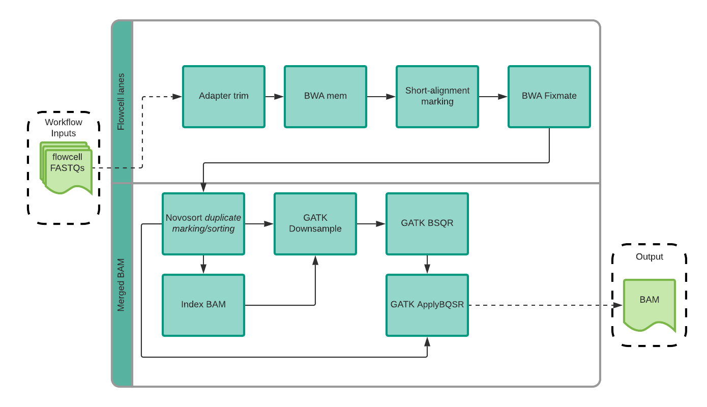

# NYGC Somatic Pipeline v7

## WGS Human Somatic Pipeline v7
- [Deliverables](#deliverables)
- [Pre-processing](#pre_processing)
- [Quality control](#qc)
- [References](#references)

### Deliverables

BAM alignments

- TUMOR.final.bam
- TUMOR.final.bai
- NORMAL.final.bam
- NORMAL.final.bai
 
SNV/INDEL/SV

- Raw SNV/INDEL/SV calls
  - TUMOR--NORMAL.indel.strelka2.v2.9.3.vcf
  - TUMOR--NORMAL.indel.svaba.v0.2.1.vcf
  - TUMOR--NORMAL.lancet.v1.0.7.vcf
  - TUMOR--NORMAL.manta.v1.4.0.filtered.vcf
  - TUMOR--NORMAL.mutect2.v4.0.5.1.vcf
  - TUMOR--NORMAL.snv.strelka2.v2.9.3.vcf
  - TUMOR--NORMAL.sv.gridss.v2.10.2.vcf.bgz
  - TUMOR--NORMAL.sv.gridss.v2.10.2.vcf.bgz.tbi
  - TUMOR--NORMAL.sv.svaba.v0.2.1.vcf
 
Merged SNV/INDEL

- SNV/INDEL calls annotated and filtered by PON and common germline variants
- HighConfidence calls
  - TUMOR--NORMAL.snv.indel.high_confidence.v7.annotated.vcf
- HighConfidence and AllSomatic (passing) calls
  - TUMOR--NORMAL.snv.indel.final.v7.annotated.vcf
- HighConfidence and AllSomatic (passing) calls (with all INFO fields from original callers)
  - TUMOR--NORMAL.snv.indel.supplemental.v7.annotated.vcf
- MAF formatted calls
  - TUMOR--NORMAL.snv.indel.final.v7.annotated.maf
- TABLE formatted calls
  - TUMOR--NORMAL.snv.indel.final.v7.annotated.txt

Merged SV

- SV calls annotated and filtered by PON and common germline variants
- HighConfidence calls
  - TUMOR--NORMAL.sv.annotated.v7.somatic.high_confidence.final.bedpe
- HighConfidence calls (with all INFO fields from original callers)
  - TUMOR--NORMAL.sv.annotated.v7.somatic.high_confidence.supplemental.bedpe
- HighConfidence and AllSomatic (passing) calls
  - TUMOR--NORMAL.sv.annotated.v7.somatic.final.bedpe
- HighConfidence and AllSomatic (passing) calls (with all INFO fields from original callers)
  - TUMOR--NORMAL.sv.annotated.v7.somatic.supplemental.bedpe

CNV

- Raw Bicseq2
  - TUMOR--NORMAL.bicseq2.v0.2.6.png
  - TUMOR--NORMAL.bicseq2.v0.2.6.txt
- CNV calls annotated and filtered by PON and common germline variants
  - TUMOR--NORMAL.cnv.annotated.v7.final.bed
  - TUMOR--NORMAL.cnv.annotated.v7.supplemental.bed

Germline

- All calls (including common germline variants)
  - NORMAL.haplotypecaller.gatk.v4.1.8.0.annotated.unfiltered.vcf
- Rare germline variants
  - NORMAL.haplotypecaller.gatk.v4.1.8.0.final.filtered.vcf.gz
  - NORMAL.haplotypecaller.gatk.v4.1.8.0.final.filtered.vcf.gz.tbi
- B-allele frequency
  - TUMOR--NORMAL.haplotypecaller.gatk.v4.1.8.0.baf.txt

MSI status

  - TUMOR--NORMAL.mantis.v1.0.4.WGS-targeted.status.final.tsv
 
HLA

- Kourami results
  - NORMAL.kourami.result
 
Mutational Signatures

- Raw deconstructSigs from HighConfidence variables
  - TUMOR--NORMAL.cosmic.v3.2.deconstructSigs.v1.9.0.signatures.highconfidence.counts.txt
  - TUMOR--NORMAL.cosmic.v3.2.deconstructSigs.v1.9.0.signatures.highconfidence.diff.txt
  - TUMOR--NORMAL.cosmic.v3.2.deconstructSigs.v1.9.0.signatures.highconfidence.input.txt
  - TUMOR--NORMAL.cosmic.v3.2.deconstructSigs.v1.9.0.signatures.highconfidence.reconstructed.txt
- Estimated proportion of each signature in the sample
  - TUMOR--NORMAL.cosmic.v3.2.deconstructSigs.v1.9.0.signatures.highconfidence.txt
  

### Pre-processing

Sequencing reads for the tumor and normal samples are aligned to the reference genome using BWA-MEM (v0.7.15) ([1](#1)).
Skewer (v0.2.2) ([2](#2)) is run to trim remaining adapter contamination from reads. NYGC’s ShortAlignmentMarking (v2.1) 
is used to mark short reads as unaligned. This tool is intended to remove spurious alignments resulting from 
contamination (e.g. saliva sample bacterial content) or from too aggressive alignments of short reads the size of
BWA-MEM’s 19bp minimum seed length. These spurious alignments result in pileups in certain locations of the genome
and can lead to erroneous variant calling. 

GATK (v4.1.0) ([3](#3)) FixMateInformation is run to verify and fix mate-pair information, followed by Novosort 
(v1.03.01) markDuplicates to merge individual lane BAM files into a single BAM file per sample. Duplicates are 
then sorted and marked, and GATK’s base quality score recalibration (BQSR) is performed. The final result of the 
pre-processing pipeline is a coordinate sorted BAM file for each sample.

### Quality control

Once preprocessing is complete, we compute a number of alignment quality metrics such as
average coverage, percent mapped reads and percent duplicate reads using GATK (v4.1.0) and an
autocorrelation metric (adapted for WGS from ([3](#3))) to check for unevenness of coverage. We also
run Conpair ([4](#4)), a tool developed at NYGC to check the genetic concordance between the
normal and the tumor sample and to estimate any inter-individual contamination in the samples.

### Somatic variant calling pipeline
3.1. Variant detection
The tumor and normal bam files are processed through NYGC’s variant calling pipeline which
consists of MuTect2 (GATK v4.0.5.1) ([5](#5))), Strelka2 (v2.9.3) (6) and Lancet (v1.0.7) (7)] for calling
Single Nucleotide Variants (SNVs) and short Insertion-or-Deletion (Indels), SvABA (v0.2.1) (8)
for calling Indels and Structural variants (SVs), Manta (v1.4.0) (9) and Lumpy (v0.2.13) (10) for
calling SVs and BIC-Seq2 (v0.2.6) (11) for calling Copy-number variants (CNVs). Manta also
outputs a candidate set of Indels which is provided as input to Strelka2 (following the developers
recommendation, as it improves Strelka2’s sensitivity for calling indels >20nt). Due to its
computing requirements, in this pipeline Lancet is only run on the exonic part of the genome. It
is also run on the +/- 250nt regions around non-exonic variants that are called by only one of the
other callers, to add confidence to such variants. Small SVs called by Manta are also used to
add confidence to the indel calls.

### References

1. Li,H. (2013) Aligning sequence reads, clone sequences and assembly contigs with BWA-MEM. arXiv [q-bio.GN].

2. Jiang,H. et al.(2014) Skewer: a fast and accurate adapter trimmer for next-generation sequencing paired-end reads. BMC Bioinformatics., 15, 182.

3. McKenna,A., Hanna,M., Banks,E., Sivachenko,A., Cibulskis,K., Kernytsky,A., Garimella,K., Altshuler,D., Gabriel,S., Daly,M., et al. (2010) The Genome Analysis Toolkit: a MapReduce framework for analyzing next-generation DNA sequencing data. Genome Res., 20, 1297–1303.

4. Bergmann,E.A., Chen,B.-J., Arora,K., Vacic,V. and Zody,M.C. (2016) Conpair: concordance
and contamination estimator for matched tumor-normal pairs. Bioinformatics, 32,
3196–3198.

5. Cibulskis,K., Lawrence,M.S., Carter,S.L., Sivachenko,A., Jaffe,D., Sougnez,C., Gabriel,S.,
Meyerson,M., Lander,E.S. and Getz,G. (2013) Sensitive detection of somatic point
mutations in impure and heterogeneous cancer samples. Nat. Biotechnol., 31, 213–219.

6. Kim,S., Scheffler,K., Halpern,A.L., Bekritsky,M.A., Noh,E., Källberg,M., Chen,X., Kim,Y.,
Beyter,D., Krusche,P., et al. (2018) Strelka2: fast and accurate calling of germline and
somatic variants. Nat. Methods, 15, 591–594.

7. Narzisi,G., Corvelo,A., Arora,K., Bergmann,E.A., Shah,M., Musunuri,R., Emde,A.-K.,
Robine,N., Vacic,V. and Zody,M.C. (2018) Genome-wide somatic variant calling using
localized colored de Bruijn graphs. Commun Biol, 1, 20.

